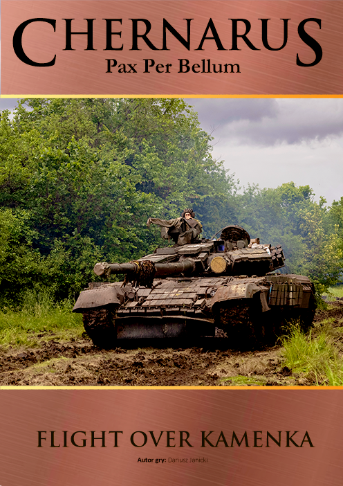

# Chernarus Pax Per Bellum
Chernarus Pax Per Bellum to seria wirtualnych gier planszowych zrealizowanych w silniku Vassal, opartych na systemie Bitwy XXI-Wieku (B-21) wydawnictwa Taktyka i Strategia.
Gry i instrukcje do systemu można zakupić m.in. tutaj:

* 👉 System WW3 Taktyka i Strategia https://taktykaistrategia.pl/kategoria-produktu/nasze-gry/?filter_system=b-xxi&query_type_system=or
* 👉 Sklep Taktyka i Strategia https://taktykaistrategiasklep.pl/


## Opis konfliktu

Seria opowiada o hipotetycznej wojnie w Republice Czarnorusi (Chernarus). Po zamachu stanu, władzę w poprzednio demokratycznym państwie przejmują prorosyjskie bojówki, a w kraju zaroiło sie od tzw "zielonych ludzików" z sąsiadujacej Federacji Rosyjskiej.

Amerykanie wietrząc problemy z dostawami bogatej w ropę i gaz Czarnorusi wysyłają grupę lotniskowców do tego regionu. Rozpoczyna się konflikt o Czarnoruś.

## 🔧 Jak uruchamiać

Do gry niezbędna jest aplikacja Vassal. Jest to darmowy silnik do uruchamiania wirtualnych gier planszowych. Można ją pobrać tutaj: https://vassalengine.org/download.html

* Pobierz i uruchom moduł **Chernarus B-21.vmod**. Jest to podstawowa wersja gry, ale zawiera jeden scenariusz - Flight over Kamenka.

## 📁 Struktura repozytorium

``` yaml
Kryzys-2025/
│
├── Chernarus B-21.vmod      # Podstawowy moduł Vassal – z jednym scenariuszem.
├── resources/               # Wspólne zasoby: ikonki, dźwięki, itp.
└── scenarios/               # Katalogi scenariuszy:
  └── [nazwa_scenariusza]/
    ├── graphics/            # Mapy, jednostki, okładki, screeny
    ├── scenario/            # Opisy scenariuszy i zmiany zasad
    ├── psd/                 # Źródła graficzne (Photoshop)
    ├── saves/               # Zapisy do gry (np. rozstawienie początkowe)
    ├── *.vmdx               # Rozszerzenie do głównego modułu
    └── *.vmod               # Czasem osobny moduł dla danego scenariusza
```

## 🎲 Scenariusze

---

### 1️⃣ Lot nad Kamienką


Walka amerykańskich spadochroniarzy z garnizonem rosyjskiego wojska w Kamience

<details>
<summary>➡️ Lot nad Kamienką - więcej informacji</summary>
Po politycznym przewrocie w Chernarusi władzę przejęła prorosyjska junta, a w kraju pojawiły się niezidentyfikowane „siły stabilizacyjne” – w rzeczywistości rosyjskie oddziały bez oznaczeń. W odpowiedzi USA wysłały zespół lotniskowcowy na Morze Czarne i rozpoczęły operację przejęcia inicjatywy. W jej ramach spadochroniarze z 82. Dywizji zostali zrzuconi w okolice Kamienki – kluczowego punktu przeładunkowego umożliwiającego przyszły desant cięższego sprzętu. Celem: szybkie zajęcie przystani i miejscowości.

Wywiad nie zidentyfikował jednak pełnej obecności rosyjskich sił w Kamience. Amerykańscy spadochroniarze – pod dowództwem poruczników Marshalla (Yellow), O’Neala (Green) i Corteza (Red) – natknęli się na większy opór, niż zakładano. Rosyjskie drużyny zmechanizowane Grigori i Vasili, zmotoryzowane Anna i Boris oraz pluton czołgów pod dowództwem kpt. Diergunowa już zajmują pozycje obronne. Stawką jest kontrola nad zachodnim wybrzeżem – i przyszłość całego regionu.
</details>
